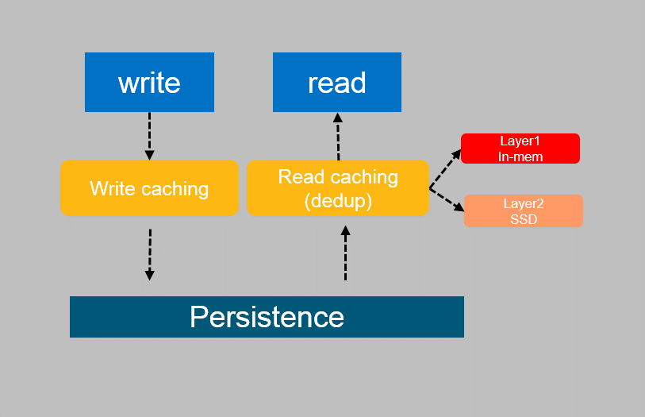

# HDCS Hyper-converged Distributed Cache Storage

HDCS is a client-side cache service architecture designed by Intel. Latency-sensitive workloads such as databases remain an emerging use case, however the networking usually cease to scale as VM density increases. With growing flash footprint on clients, flash-based read/write caching has the potential to improve storage latency by reducing IO path dependency on network/cluster. 

## Important Notice and Contact Information

HDCS is not a product, and it does not have a full-time support team. Before you use this tool, please understand the need to invest enough effort to learn how to use it effectively and to address possible bugs.

For other questions, contact jian.zhang@intel.com, yuan.zhou@intel.com or chendi.xue@intel.com

## Licensing

Intel source code is being released under the Apache 2.0 license.

## Introduction

With the strong requirements of cloud computing and software defined architecture, more and more data centers are adopting distribute storage solutions, which usually centralized, based on commodity hardware, with large capacity and designed for scale-out solution. However, the performance of the distribute storage system suffers when running multiple VM on the compute node due to remote access of VM I/O in this architecture, especially for database workloads.  Meanwhile, the critical enterprise readiness features like deduplication, compression are usually missed.

In this work we proposed a new novel client-side cache solution to improve the performance of cloud VM storage, which will turn current common cloud storage solution into a hyper converged solution. In our cache solution it provides strong reliability, crash-consistent, various data services like deduplication and compression on non-volatile storage backend, with configurable modes like write-through and write-back. The interface of cache is designed to be flexible to use external plugins or third parity cache software. Our evaluation shows that this solution has great performance improvements to both read-heavy and write-heavy workloads. We also investigated the potential usage of Non-Volatile Memory Technologies in this cache solution.

## Architecture

The general read/write flow is:

## Installation & Testing

 - install depedency package: librbd-devel, rocksdb, boost-thread, boost-system
 - `cd hdcs-src; make; sudo make install`
 - `sudo mkdir /etc/rbc/; sudo cp general.conf /etc/rbc/`
 - patch the librbd source code and rebuild librbd

